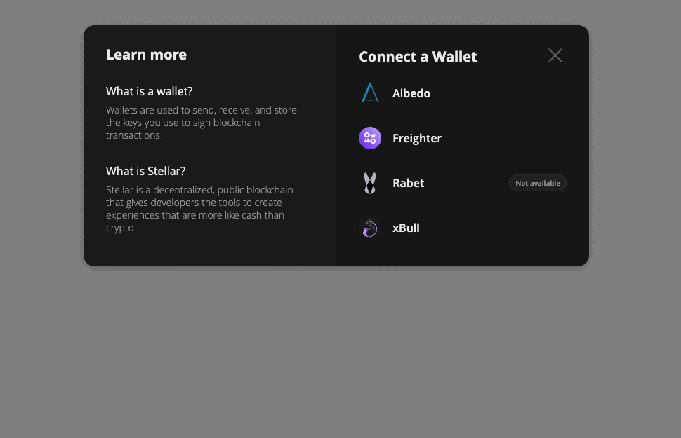

A kit to handle all Stellar Wallets at once with a simple API and without caring about individual configurations for each one of them. This library cares only about the connection and interaction with the wallets, allowing developers handling the UI/UX in the way they want.

## Documentation
[https://creit-tech.github.io/Stellar-Wallets-Kit/](https://creit-tech.github.io/Stellar-Wallets-Kit/)

## Compatible Wallets:

- xBull Wallet (Both PWA and extension version)
- Albedo
- Freighter
- WalletConnect v2 (Lobstr, xBull Wallet, etc)
- Rabet (extension version)

## Installation

```shell
npm i --save github:Creit-Tech/Stellar-Wallets-Kit
```

Install the latest version available in our repo, we use Github instead of NPM because this way you can check the code before installing it which in our view is safer.

> We recommend you using version tags when installing the library, this way you have control when doing an `npm i` like this: `npm i github:Creit-Tech/Stellar-Wallets-Kit#<tag or commit hash>`

## The StellarWalletsKit class

The first step will be creating a new instance from the main class, you should only create one instance in order to avoid unexpected results.

```typescript
import { StellarWalletsKit, WalletNetwork, WalletType } from 'stellar-wallets-kit';

const kit = new StellarWalletsKit({
  network: WalletNetwork.TESTNET,
  selectedWallet: WalletType.XBULL
});
```

## Integrated UI modal



The library integrates a UI modal you can show your users after you have started the kit. Once they pick the wallet they want to use you can then use the other methods available. Here is how you can use it:
```typescript
await kit.openModal({
  onWalletSelected: async (option: ISupportedWallet) => {
    kit.setWallet(option.type);
    const publicKey = await kit.getPublicKey();
    // Do something else
  }
});
```

And as simple as that you will give full support to all the Stellar wallets plus you don't even need to handle the modal UI yourself. 

The `openModal` method also lets you update multiple things about the model like the title, the allowed wallets or even the styles of it! Here are the accepted parameters:

```typescript
function openModal(params: {
    onWalletSelected: (option: ISupportedWallet) => void;
    onClosed?: (err: Error) => void;
    modalDialogStyles?: { [name: string]: string | number | undefined | null; }
    allowedWallets?: WalletType[];
    modalTitle?: string;
    notAvailableText?: string;
}) {}
```


## Request the public key and sign transactions

Each wallet has its own way when it comes to both requesting the public key and signing a transaction. Using this kit you can do both actions with a unified API:
```typescript
const publicKey = await kit.getPublicKey();

// AND

const { signedXDR } = await kit.sign({
  xdr: '....',
  publicKey,
});
```

Both methods will trigger the action targeting the wallet you have set before calling those methods.

> IMPORTANT: The parameter `publicKey` in the method `sign` is optional, but we highly suggest using it because there are wallets which have special requirements regarding that so in order to avoid unexpected behavior it's better to provide it.

## WalletConnect

Handling WalletConnect requires a few extra steps but this kit reduces a lot the complexity behind it.

### Start the WalletConnect client

The first step is setting the WalletConnect client, in order to do it you need to execute the method `startWalletConnect` with the WalletConnect metadata for your app.

```typescript
await kit.startWalletConnect({
  name: 'NAME_OF_APP',
  description: 'DESCRIPTION_OF_APP',
  url: 'URL_OF_APP',
  icons: [
    'URL_OF_ICON'
  ],
  projectId: 'PROJECT_ID_FROM_WALLET_CONNECT',
})
```

> You need to wait until it has completely started, otherwise other methods will throw an error.

### Connect in order to create a new session

In WalletConnect we use `sessions` which are handled by WalletConnect itself, with these sessions we are able to tell WalletConnect to which wallet the request should be done. In order to create a new session with this kit you need to use the method `connectWalletConnect` like this:

```typescript
await this.walletService.kit.connectWalletConnect();
```

By default, the method will try to create a new session by showing the classic WalletConnect QR but if you already have a valid pairing topic you can pass it as a parameter. You can also set the accepted chains and methods to use.

```typescript
export interface IConnectWalletConnectParams {
  chains?: WalletConnectTargetChain[];
  methods?: WalletConnectAllowedMethods[];
  pairingTopic?: string;
}
```

After you have successfully created the session you will be able to call the regular methods `getPublicKey` or `sign`.

> IMPORTANT: Version 2.0 from WalletConnect introduces a new way to create and activate pairings, this is something that is not yet supported by popular wallets so currently is not supported in this kit.


## Extra methods

There will be moments where you would like to change certain parameters from the kit like the selected wallet, the network, etc... or maybe listening when a WalletConnect session was removed. These methods will help you in those situations: 

### Set the target wallet

```typescript
await kit.setWallet(WalletType.XBULL)
```

### Set the target network

```typescript
await kit.setNetwork(WalletNetwork.TESTNET);
```

### Get WalletConnect sessions
```typescript
const sessions = await kit.getSessions();
```

### Set the WalletConnect session ID
```typescript
await kit.setSession(sessionId);
```

### Listen to WalletConnect sessions being removed
```typescript
kit.onSessionDeleted((sessionId: string) => {
  // ...
});
```

And more methods, check the documentation to see all the methods available.

## License


Licensed under the MIT License, Copyright © 2023-present Creit Technologies LLP.

Checkout the `LICENSE.md` file for more details.


